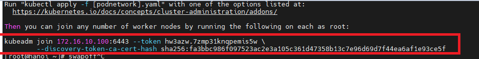

# Cài đặt Kubernetes trên Centos 7

## Cấu hình hardware

| Tên máy/Hostname | Thông tin hệ thống                                                                 | Vai trò             | Cấu hình        |
| ---------------- | ---------------------------------------------------------------------------------- | ------------------- | --------------- |
| hanoi            | HĐH CentOS7, Docker CE, Kubernetes. Local IP 172.16.10.100, public IP 192.168.1.20 | Khởi tạo là master  | 2 CPUs, 4Gb Ram |
| saigon           | HĐH CentOS7, Docker CE, Kubernetes. Local IP 172.16.10.101, public IP 192.168.1.21 | Khởi tạo là worker1 | 2 CPUs, 2Gb Ram |
| cantho           | HĐH CentOS7, Docker CE, Kubernetes. Local IP 172.16.10.102, public IP 192.168.1.22 | Khởi tạo là worker2 | 2 CPUs, 2Gb Ram |
| angiang          | HĐH CentOS7, Docker CE. public IP 192.168.1.22                                     | Rancher             | 2 CPUs, 4Gb Ram |

Cấu hình tối thiểu là 6 Core 16gb Ram

## Let's go

[Link download Vagrant](https://www.vagrantup.com/)

1. Vào thư mục vagrant/script/centos-common.sh sửa lại host theo đúng IP. (Có thể để mặc định).
2. Mở terminal & dùng lệnh **cd** để chuyển đến thư mục server (hanoi, saigon, cantho, angiang) cần tạo.
3. Chạy lệnh `vagrant up` để khởi tạo server.
4. Sau khi khởi tạo xong 1 master & 2 worker, ssh vào vm **master(hanoi)** để config.
5. Chạy lệnh `swapoff -a`
6. sau đó, `kubeadm init --apiserver-advertise-address=172.16.10.100 --pod-network-cidr=192.168.0.0/16`

7. Copy như code như hình & chạy ở 2 VM Worker 1 & 2 (saigon, cantho)
8. Thiết lập Pod Network  `export kubever=$(kubectl version | base64 | tr -d '\n')`
9. `kubectl apply -f "https://cloud.weave.works/k8s/net?k8s-version=$kubever"`

## Cheat sheet
1. kubectl config set-context --current --namespace=`namespace name`